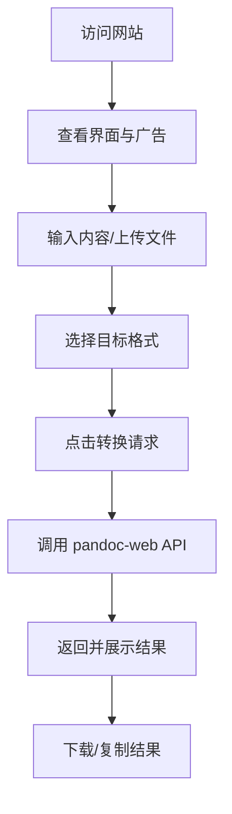

## 1. 产品概述
基于 pandoc 和 pandoc-web 项目开发的在线文档转换静态网站，旨在为用户提供快速、美观的文档格式转换服务，并通过植入广告实现盈利。
- 解决文档格式转换需求，目标用户为学生、办公人员及开发者。
- 提供具有设计感、易于使用的界面，以提升用户体验并增加广告曝光。

## 2. 核心功能

### 2.1 功能模块
1. **首页**：核心转换区域、广告展示区、关于我们、格式说明。

### 2.2 页面详细说明
| 页面名称 | 模块名称 | 功能描述 |
|-----------|-------------|---------------------|
| 首页 | 转换器 | 支持输入文本，选择输入和输出格式，一键转换并展示/下载 |
| 首页 | 广告位 | 页面两侧或底部预留广告空间，实现流量变现 |
| 首页 | 格式说明 | 展示支持的各种文档格式及其优势 |

## 3. 核心流程
用户进入网站，浏览或忽略广告，在转换器中输入内容，选择目标格式，点击转换，并下载或复制结果。

## 4. 用户界面设计
### 4.1 设计风格
- 主色调与辅助色：采用极简主义设计，深色模式与浅色模式支持，突出核心转换区。主色调使用品牌蓝（如 #2563EB），背景采用干净的米白色或深灰。
- 按钮风格：圆角、带有轻微阴影，悬停时有动效。
- 字体与大小：使用具有科技感且优雅的字体（如 Inter 或 Space Grotesk），标题字号较大。
- 布局风格：居中卡片式布局，两侧预留广告位，确保不影响核心功能操作。
- 图标风格：使用简洁的线条图标。

### 4.2 页面设计概览
| 页面名称 | 模块名称 | UI 元素 |
|-----------|-------------|-------------|
| 首页 | 头部 | Logo、标语、暗/亮色切换按钮 |
| 首页 | 转换卡片 | 双栏布局（左侧输入，右侧输出），下拉框、巨大的“转换”按钮 |
| 首页 | 广告位 | 优雅的占位符（可替换为 Google AdSense 标签） |

### 4.3 响应式设计
桌面端优先设计，核心卡片居中；移动端适配为上下布局，广告位根据屏幕宽度自动隐藏或移至底部，保证触摸操作流畅。