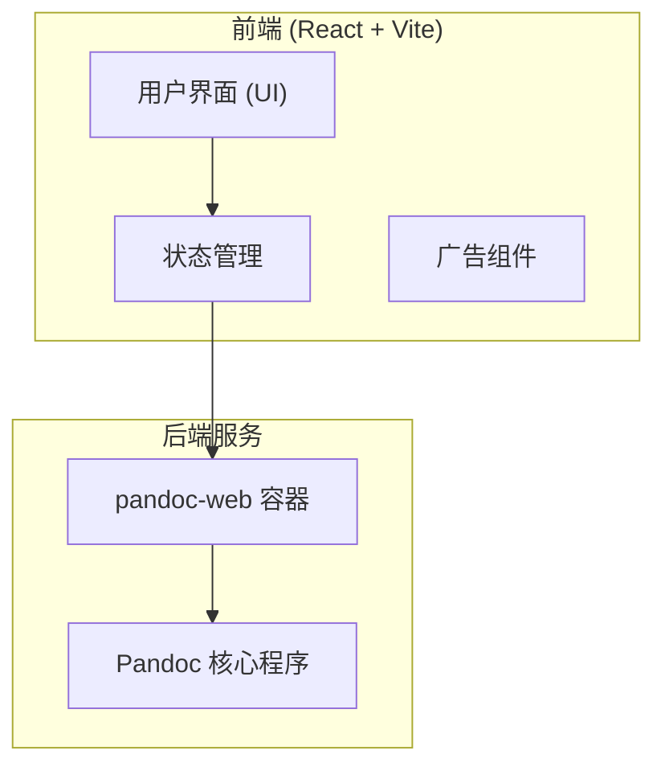

## 1. 架构设计

## 2. 技术栈描述
- 前端框架：React@18 + tailwindcss@3 + vite
- 图标库：lucide-react
- 动画库：framer-motion
- 后端服务：使用 Docker 运行的 `ghcr.io/synyx/pandocweb:latest` 提供 API（可独立部署，由前端代理调用）。

## 3. 路由定义
| 路由 | 用途 |
|-------|---------|
| / | 首页，包含文档转换器及广告展示 |

## 4. API 定义
前端通过代理或直接调用本地启动的 pandoc-web 接口（默认端口 8080）。
- **转换请求**：
  - `POST /api/convert` (根据 pandoc-web 的实际接口而定)
  - 请求体：包含待转换的文本、输入格式以及输出格式。
  - 响应：转换后的文档内容或文件流。

## 5. 数据模型
静态前端项目，无复杂状态，不涉及数据库模型。